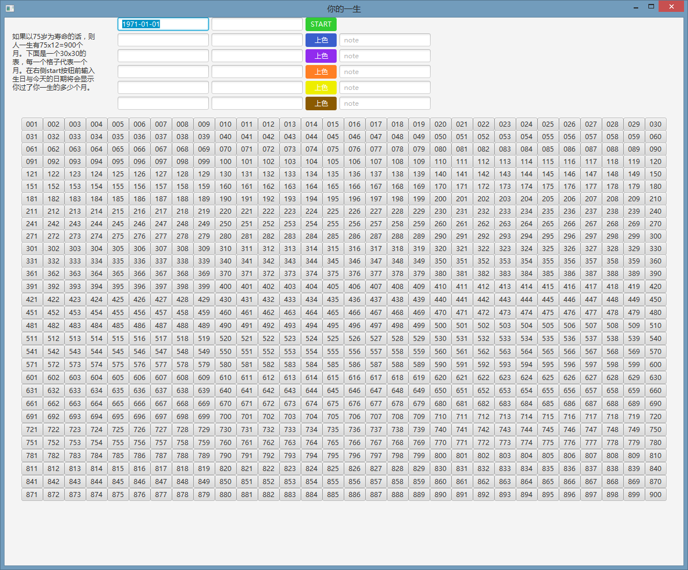
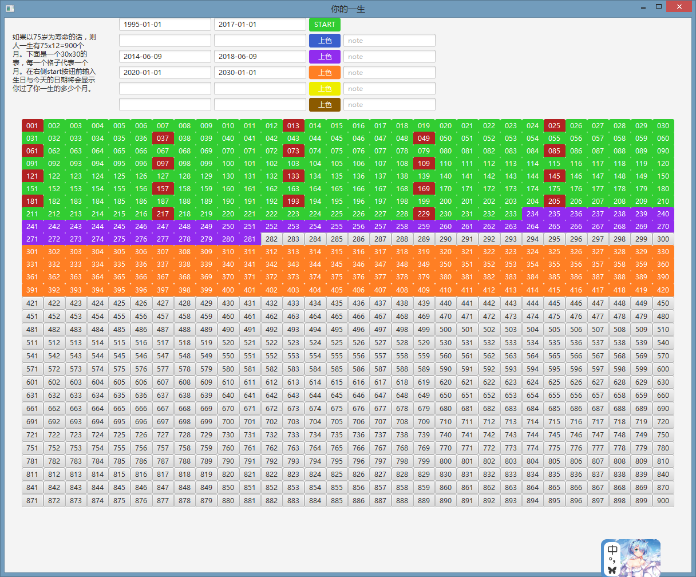

# YourLife

假设你可以活到75岁，那么将你的一生以月为最小单位显示在屏幕上面的话就是75(年)x12(个月)=900(个)=30(行)x30(列)

## 如何使用

主界面 
</img>
1. 第一行输入你的出生日期与现在的时间(或者任何你想看的日期)
2. 下面过去的时间将以绿色显示出来，红色的是生日月，数字则是你出生后活的第几个月
3. 你还可以对你的人生进行分阶段，每一个阶段的开始日期与结束日期分别输在下面你想要显示颜色的左侧输入框内 

</img>